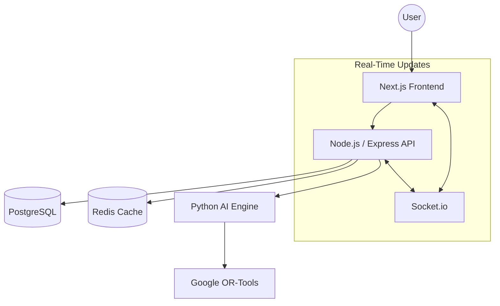

# 🎓 VNSGU Timetable Management Platform (NEP-Scheduler)

[](https://opensource.org/licenses/MIT)
[](https://pnpm.io/)
[](https://developers.google.com/optimization)

**NEP-Scheduler** is a high-performance, AI-driven academic scheduling platform designed for large-scale universities like VNSGU. It automates the complex task of generating conflict-free, workload-balanced timetables while adhering to **NEP 2020** mandates.

---

## 🏗️ System Architecture

The project is structured as a **Polyglot Monorepo**, isolating concerns while maintaining strong type safety across the stack.



### Microservices Breakdown
| Service | Tech Stack | Responsibility |
| :--- | :--- | :--- |
| **`apps/web`** | Next.js 14, Tailwind, Shadcn | Multi-role responsive dashboard (4 Panels). |
| **`apps/api`** | Node.js, TypeScript, Prisma | Business logic, RBAC, and AI orchestration. |
| **`apps/ai-engine`**| Python 3.10, FastAPI | Constraint solving and optimization logic. |
| **`packages/types`** | TypeScript | Shared Zod schemas and TypeScript interfaces. |

---

## 🧠 The AI Scheduling Engine

The "brain" of the platform uses **Google OR-Tools CP-SAT Solver** to resolve billions of possible scheduling combinations in seconds.

### 🛡️ Hard Constraints (Immutable)
- **Faculty Availability**: No faculty can be in two rooms at once.
- **Room Conflict**: No classroom can host two different batches simultaneously.
- **Batch Integrity**: A student batch cannot have overlapping lectures.
- **Capacity**: Batch strength must not exceed room capacity.
- **Lab Requirements**: Lab sessions must be assigned to Lab-type resources.

### 📈 Soft Constraints (Optimized)
- **Workload Balance**: Distribute hours evenly across faculty members.
- **No Gaps**: Minimize "empty slots" in faculty and student daily schedules.
- **Preferred Slots**: Prioritize major subjects for morning hours.

---

## 🛠️ Feature Matrix

The platform is divided into 4 specialized panels to handle the university hierarchy:

### 1. Global Superadmin
- Managing multiple university tenants.
- Global user credential control and audit logging.
- Cross-university timetable monitoring.

### 2. University Admin
- Full infrastructure management (Classrooms, Labs, Departments).
- Faculty pool coordination and primary/secondary workload assignment.
- Global university-level scheduling parameters.

### 3. Department Admin
- Granular control over department-specific courses and batches.
- **Standard Generation**: AI-triggered master schedules.
- **Special Contingency**: Regenerate schedules on-the-fly when faculty are absent.

### 4. Faculty Portal
- Personalized weekly schedule view.
- Real-time updates on room changes or substitutions.
- Profile and credential management.

---

## 🚀 Getting Started

### Prerequisites
- [Node.js 20+](https://nodejs.org/)
- [Python 3.10+](https://www.python.org/)
- [pnpm 8+](https://pnpm.io/)
- [Docker & Docker Compose](https://www.docker.com/)

### 📦 Local Installation (Docker)
The entire stack (DB, Redis, AI Engine, API) can be started with a single command:

```bash
# 1. Clone the repository
git clone https://github.com/WhiteDevil-rss/TimeTableGenerator.git
cd TimeTableGenerator

# 2. Start the infrastructure
docker-compose up -d

# 3. Seed the database (from apps/api)
cd apps/api
pnpm install
npx prisma db push
npx prisma db seed

# 4. Run the frontend
cd ../web
pnpm install
pnpm run dev
```

---

## 🔑 Demo Credentials

| Role | Email | Password |
| :--- | :--- | :--- |
| **Superadmin** | `admin@nepscheduler.com` | `password123` |
| **Uni Admin** | `admin@vnsgu.ac.in` | `password123` |
| **Dept Admin** | `admin.cs@vnsgu.ac.in` | `password123` |

---

## ☁️ Deployment

This project is optimized for **Google Cloud Platform (GCP)** using:
- **Cloud Run** for horizontal scaling of microservices.
- **Cloud SQL** for managed PostgreSQL.
- **Memorystore** for managed Redis.

See the [In-depth GCP Deployment Guide](./gcp_deployment_guide.md) for step-by-step instructions.

---

## 📄 License
Distributed under the MIT License. See `LICENSE` for more information.

*Built with ❤️ for VNSGU by Antigravity AI.*
