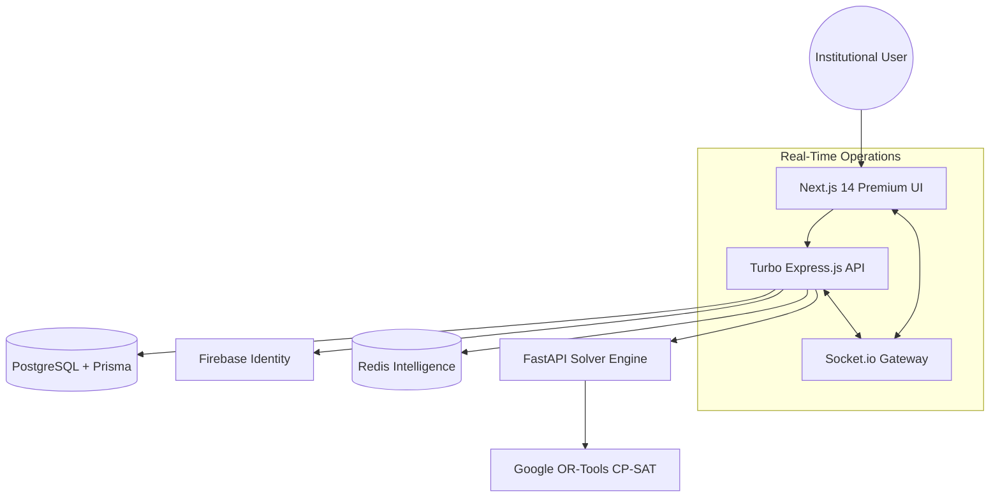

# 🎓 SmartCampus OS
### The Intelligent Operating System for Modern Institutions

[](https://github.com/WhiteDevil-rss/SmartCampusOS)
[](https://opensource.org/licenses/MIT)
[](https://turbo.build/)
[](https://developers.google.com/optimization)

**SmartCampus OS** is a high-performance, AI-driven academic orchestration platform designed to transform traditional campus management into a seamless digital ecosystem. It leverages cutting-edge constraint-solving algorithms and a premium glassmorphic UI to provide an unparalleled experience for administrators, faculty, and students.

---

## 🚀 Vision & Purpose
In the era of **NEP 2020**, educational institutions face unprecedented complexity in resource allocation. SmartCampus OS eliminates the manual friction of scheduling, resource management, and departmental coordination through:
- **Autonomous Scheduling**: Resolving billions of constraints in seconds.
- **Institutional Integrity**: Real-time synchronization across departments.
- **Predictive Analytics**: Forecasting resource needs and optimizing occupancy.

---

## 🏗️ System Architecture
The platform is built on a **Polyglot Monorepo** architecture, optimized for speed, scalability, and type safety.



### Infrastructure Breakdown
| Component | Technology | Role |
| :--- | :--- | :--- |
| **Edge Web** | Next.js 14, Framer Motion, Tailwind | High-fidelity, role-based dashboards with glassmorphic aesthetics. |
| **Core API** | Node.js, TypeScript, Prisma | Orchestration layer, RBAC, and Firebase Auth synchronization. |
| **AI Engine** | Python 3.10, FastAPI | Constraint programming and combinatorial optimization. |
| **Persistence** | PostgreSQL, Redis | Relational data integrity and high-speed caching. |

---

## 💎 Core Features

### 1. The SolvEngine™ (AI Scheduler)
Powered by **Google OR-Tools**, our scheduling engine handles:
- **Hard Constraints**: Ensuring zero faculty collisions, room conflicts, or batch overlaps.
- **Soft Constraints**: Balancing faculty workload, minimizing "dead hours", and optimizing preferred time slots.
- **Real-time Regeneration**: Instantly adapt schedules for faculty leave or resource outages.

### 2. Institutional Gateway
- **Unified Identity**: Seamless Firebase integration with automated PostgreSQL synchronization.
- **Audit Trails**: Enterprise-grade activity logging with device fingerprinting and IP tracking.
- **RBAC Matrix**: Deep control for Superadmins, University Admins, and Department Heads.

### 3. Smart Resource Management
- **Occupancy Intelligence**: Track classroom and lab utilization across the campus.
- **Conflict Safeguards**: Intelligent trapping system prevents accidental deletion of active dependencies.

---

## 🛠️ Setup & Installation

Follow these steps to deploy the SmartCampus OS ecosystem locally:

### Prerequisites
- **Node.js**: v18+ (pnpm recommended)
- **Python**: v3.10+
- **Docker**: For database and cache orchestration

### 1. Launch Infrastructure
Spin up the core services using Docker:
```bash
docker-compose up -d
```

### 2. Configure Backend
Initialize the database and sync the environment:
```bash
cd apps/api
pnpm install
npx prisma db push
npx prisma db seed # Initializes the 'SmartCampus OS' environment
pnpm run dev
```

### 3. Launch Frontend
Deploy the premium interface:
```bash
cd apps/web
pnpm install
pnpm run dev
```

Visit `http://localhost:3000` to access the OS.

---

## 🔑 Default Access Credentials

| Identity Role | Authorized Identifier | Access Key |
| :--- | :--- | :--- |
| **Superadmin** | `admin@smartcampus.ac.in` | `password123` |
| **University Admin** | `vc@smartcampus.ac.in` | `password123` |
| **Department Admin** | `admin_dcs@smartcampus.ac.in` | `password123` |
| **Faculty Core** | `dharmen@smartcampus.ac.in` | `password123` |

---

## ☁️ Deployment Strategy
Optimized for **Google Cloud Platform (GCP)**:
- **Cloud Run**: Global scaling for microservices.
- **Cloud SQL**: Managed PostgreSQL high availability.
- **Cloud Tasks**: Managed queue for heavy AI solve operations.

Check the [Infrastructure Guide](./gcp_deployment_guide.md) for enterprise deployment.

---

## 📝 License
Distributed under the MIT License. Developed and maintained with ❤️ by [WhiteDevil-rss](https://github.com/WhiteDevil-rss).

*SmartCampus OS - The Future of Institutional Intelligence.*