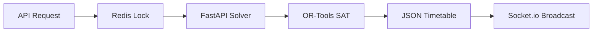

# SmartCampus OS: Engineering Wiki

Welcome to the central repository of knowledge for **SmartCampus OS**. This document serves as the technical "Source of Truth," blending the visionary 22-service architecture with the current production-hardened implementation.

---

## 1. Architectural Pulse
SmartCampus OS uses a **Polyglot Monorepo** architecture designed for ultra-low latency and verifiable academic records.

| Layer | Responsibility | Implementation |
|---|---|---|
| **Frontend** | 7-Panel Multi-Tenant UI | Next.js 14 + Tailwind v4 + Shadcn |
| **API Layer** | Core Business Logic | Node.js 20 + Express + Prisma |
| **Intelligence** | High-Performance Solvers | Python 3.10 + FastAPI + OR-Tools |
| **Real-time** | Live Telemetry & Feed | Socket.io + Redis Pub/Sub |
| **Persistence** | Relational + Caching | PostgreSQL 15 + Redis 7 |
| **Trust Layer** | Audit Immutability | Polygon L2 + Solidity Smart Contracts |

---

## 2. Hardened Infrastructure (Post-Audit v1.0)
The platform recently underwent a **10-Phase Security & Performance Audit**. Key technical guardrails:

### 🛡️ Security Posture
- **API Defense**: `helmet` (HSTS/CSP), `express-rate-limit` (Window: 15m, Max: 100), and `csurf` protection.
- **XSS/Pollution**: Global sanitization middleware for all incoming requests.
- **Secrets Management**: Varlock-ready Environment Variable isolation.

### ⚡ Performance Optimizations
- **Database**: GIN indexes for JSONB metadata and B-tree indexes for `email`/`enrollment_no`.
- **Concurrency**: `ioredis`-based distributed locking to prevent racing during AI timetable generation.
- **Frontend**: GPU-accelerated mesh gradients using `will-change: transform` and `translateZ(0)`.

---

## 3. Core Data Streams

### Live Timetable Generation

### Immutable Academic Logs
Academic results are not just stored in PostgreSQL; they are hashed and anchored to the **Polygon L2** blockchain for 3rd-party verification.
- **Hash Algorithm**: SHA-256 of the Canonical JSON representation.
- **Contract Address**: Documented in `CONTRACTS.md`.

---

## 4. Operational Excellence

### Local Development
- **Main Command**: `pnpm run dev:all` (Starts Web, API, and worker).
- **Tooling**: Turborepo for parallel builds and execution.

### Deployment Cycle
- **CI**: Automated GitHub Actions run `lint`, `test`, and `build` on every PR.
- **Containerization**: Standardized `docker-compose.yml` for Node.js and Python microservices.

---

*© 2026 SmartCampus OS — Engineering Excellence — Finalized Audit v1.0*
